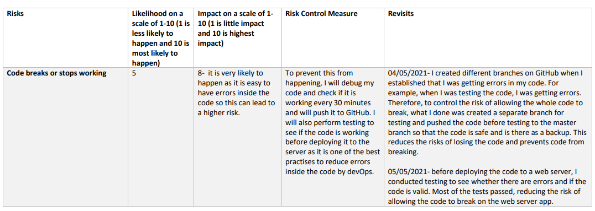
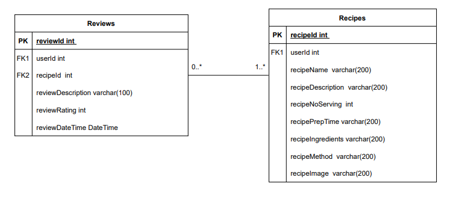

# CookBookApp
### Abstract
____________________________________________
The CookBookApp will include different type of recipes. The users will be able to interact with the cook book app through CRUD functionalities such as add, read, update and delete recipes on the cook book app. The app is mainly designed to allow different types of users to view various types of recipes, allowing them to use the recipes available on cook book app to enhance their both cooking and learning techniques. This app can be used by anyone whether they just want to view recipes for their cooking or to help others by adding in recipes to the app. The cook book app will also allow the users to leave a review for a recipe and view other reviews for each recipe. This feature will be designed to help other users to decide whether or not they should use that recipe and if it is ideal for cooking or not. This project will follow an agile methodology, followed by diagrams, risk assessement carried out and requirements that will be gathered to execute the interactive cookBookApp. Lastly, unit testing and continous integration will also be performed, and I will also be deploying the app to allow the users to use it. 

### Aim and Objectives
_____________________________________________
The aims and objectives of this projects are as the following:
<table>
  <body>
    <tr>
      <th>Aims </th>
      <th align="center">Objectives</th> 
    </tr>
    <tr>
      <td><ul><li>Use an agile methodology to manage the project</li></ul></td>
      <td align="left"><ul>
          <li>Will use an agile methodology called Trello board to set deadlines for tasks and carry out tasks</li>
          <li>On the Trello board, will create user stories, use cases and tasks which are needed to complete the project</li>
        </ul></td>
    </tr>
    <tr>
      <td><ul><li>Create a design which describe the architecture of the Cook Book App</li></ul></td>
      <td align="left"><ul><li>Will create a list of requirements using the MoSCoW technique</li>
        <li>Will draw diagrams such as the ERD, use case diagrams and wireframes</li>
        <li>Will carry out risk assessement to demonstrate the potential risks within this project</li>
        </ul></td>
    </tr>
    <tr>
      <td><ul><li>Create a working CRUD functionality created for the Cook Book App using a database and coding</li></ul></td>
      <td align="left">
      <ul><li>Will be using programming languages such as C# to create the backend of the CRUD functionality</li>
      <li>Will be using MySQL database to store the data for the recipes and reviews and connect it to C#</li></ul>
      </td>
    </tr>
    <tr>
      <td>
        <ul>
          <li>create a working front end functionality Cook Book App</li>
        </ul>
      </td>
      <td align="left"><ul>
          <li>Will be using ASP.NET, HTML and CSS to create the front end, allowing the users to interact with the Cook Book App</li>
        </ul></td>
    </tr>
    <tr>
      <td>
        <ul>
          <li>Testing for the Cook Book App</li>
        </ul>
      </td>
      <td align="left"><ul>
          <li>Carry out unit testing and automated testing to validate the application</li>
           <li>Provide consistent reports and evidence using a TDD approach</li>
        </ul></td>
    </tr>
     <tr>
      <td>
        <ul>
          <li>Integrate the code for the Cook Book App</li>
        </ul>
      </td>
      <td align="left"><ul>
          <li>Contionous integration of the code into a VCS (Version Control System) using the Feature-Branch model</li>
           <li>Deploy the Cook Book App to a cloud-based virtual machine through a CI server</li>
        </ul></td>
    </tr>
  </body>
</table>

### Project Tracking tool
_______________________________________________________
For my CookBookApp project, I used a Trello Kanban board to create user stories (which explains the existence of each functonality and what benefit will it bring to us) and tasks which will make it easier for me to follow the project specifications. Below is my Kanban Board that shows the tasks I have to do, the tasks I am doing currently, testing and lastly the tasks I have completed successfully. I have also added a tool section in my Kanban board to show which tools I have used in this project. User stories have also been implemented and have been labelled. To view my trello board, please click on this link https://trello.com/b/oaleSto7/cookbookapp 

### Functional and Non-functional Requirements 
_______________________________________________________________________
The table below shows the requirements of the project using the MoSCoW technique where I will be prioritising requirements.
<table>
  <body>
    <tr>
      <th align="centre">Must Have </th>
      <th align="centre">Should Have</th> 
      <th align="centre">Could Have</th> 
      <th align="centre">Wont Have</th> 
    </tr>
    <tr>
      <td align= "left">The user must be able to read the recipes on the Cook Book App</td>
       <td align= "left">The user can view reviews</td>
      <td align= "left">The user can register</td>
      <td align= "left">The admin can login</td>
    </tr>
    <tr>
      <td align="left">The user must be able to add the recipes to the Cook Book App</td>
       <td align= "left">The user can add reviews</td>
  <td align= "left">The user can login</td>
  <td align= "left">The admin can manage users E.g. delete, update users</td>
    </tr>
    <tr>
      <td align="left">The user must be able to update the recipes to the Cook Book App</td>
      <td align= "left">The user can update a review</td>
      <td align= "left">The user can validate their username and password</td>
       <td align= "left">The admin can track the users performance E.g datetime user logged in and out</td>
    </tr>
    <tr>
      <td align="left">The user must be able to delete the recipes to the Cook Book App</td>
      <td align="left">The user can delete a review</td>
      <td align="left"></td>
       <td align= "left">The admin can manage reviews.E.g delete reviews</td>
    </tr>
</table>

### Use Case diagram 
_________________________________________________________________
Below is the the use case diagram which demonstrates how the user will be interacting with the system which in this case is the Cook Book App (Please note that for implementation, I will only be interacting with two database tables which are recipes and reviews).

### Entity diagram 
________________________________________________________________________
Below is the Chen's conceptual model for the CookBook App. The diagram consists of entity types which in this case are Recipes, Users and Reviews, it also consists of relationships which are manages and contains. The user will manage recipes which in further detail means that the user can add/delete/update/review recipes. For the following entity types, there are different types of attributes such as primary key, foreign key and other attributes. The attributes in yellow are the primary key and the attributes in pink are the foreign key, which essentially means that this attribute was inherited from another table. 

Below is the UML logical model for the CookBook App. The diagram explores the different types of tables that will be on the database and how these tables will be interacting with one and another. For example, the recipeID will be retrieved in the Reviews table. This is to allow the users to add or read a review of a certain recipe. 

The relationship between the Users and Recipes is one to many which means that one user can add many recipes and in other words it means that many recipes can be added by one User. The relationship between the Users and Reviews is again one to many as one user can add many reviews too. 

### Front End of the App
____________________________________________________________________

In this section, I will be demonstrating the front end of the CookBookApp, where the user will be directly interacting with the app.

Below is the home page of the CookBookApp which will allow the user to navigate to the recipes page and explore different types of recipes.

Below is the All Recipes page of the CookBookApp which will allow the user to explore different type of recipes.

Below is the Add Recipe page on the CookBook App which will allow the users to add a recipe, allowing them to help others with cooking. 

Below are the details for one recipe

Below is the edit recipe page, where the user will be allowed to edit the recipe they have uploaded, incase they may have made any mistakes and want to make amendments. 

Below is the add review page, where a user can leave a review on any recipe they would like to. This will help others decide whether or not they should this recipe or not.

Below is the reviews for recipes, this will allow the user to view all reviews for a certain recipe. 

### Testing Report
_________________________________________________________________________

xUnit tests were used to run the tests for the CookBookApp. xUnit test is a unit testing tool which is mainly designed for the .NET framework. The CookBookApp I have created runs on .NET framework and is a console MVC app. The reason why I used xUnit testing is to compile the code and to detect problems during the early phase of developing the app before actually deploying the app. For the CookBookApp, I have tested all of my controllers and actions as shown on the screenshot below. However, some of the actions returned null which resulted in some of my tests failing. I used a structure to write my code for testing which was to start off with arranging the test then performing the action and lastly asserting it. I also created Moqs, interfaces and repositories to help me test the controllers of the CookBookApp. As you can see that the test coverage for the Recipes Controller is 76.4% for the Review Controller the test coverage is 71.7%. 

### Risk Assessement 
____________________________________________________________________________

### Revisits - Updated Version of diagrams after the implementation 
_______________________________________________________________________________________________

In this project. I was able to implement the must requirements which was stated in the project requirements section on this documentation previously. I was also able to implement other requirements too. 

The following requirements that have been implemented in this project are:
* The user must be able to view recipes 
* The user must be able to add recipes 
* The user must be able to edit recipes
* The user must be able to delete recipes
* The user must be able to add reviews 
* The user must be able to view reviews

Here is an updated version of my use case diagram below, whcich shows the requirements of this project that have been implemented. 

Here is an updated version of my ERD after the implementation. The ERD diagram below explores the zero to many and one to many relationships between recipes and reviews. The relationship between both recipes and reviews are as the following:
* One recipe can have zero reviews 
* One recipe can have many reviews 
* Zero reviews may exist in one recipe
* Many reviews may exist in many recipes 

Below is the Chen style version of the logical ERD diagram:

Below is an updated version of my Kanban board. I have completed all of the required tasks successfully. However, was unable to create a prototype for the CookBookApp as I ran out of time. 

### Evaluation 
_________________________________________________________________

The strengths of this project were that:
* I was able to use a Trello Kanban Board successfully.
* I was able to complete the CRUD functionality successfully and was able to link the two tables on the database successfully. For example, I was able to retrieve the RecipeID in my Reviews table in the database and was able to add reviews and views for a certain recipe. 
* I was able to use ASP.NET, HTML and CSS as my front end and back end. 
* I was able to connect the workBench with AzureMySql and ASP.NET
* I was able to test both of my recipes and reviews controller and generated a report for them to show the overall test coverage 
* I was able to deploy my app on the Azure App Service through publishing the app on visual studio and was able to perform continous integration. 
* I was able to re-create all of my diagrams and revisit them to compare what I had before the implementation and after the implementation, allowing me to suggest future work that may be required for the app by using the MoSCoW technique. 
* I was able to carry out the risk assessements and I also revisited the risks to see how I mitigated the risk 
* I was able to push my CookBookApp code to the github successfully.
* I was able to use all of the tools that I learnt during the training and apply them to my project.

The weaknesses of this project were that:
* I was not able to deploy the app through the Azure pipelines as the build failed, therefore had to use an alternative way to deploy the CookBookApp. However, I was able to build the code and create a YAML file as shown below:

* I was not able to do alot of work on the front end of the side to make the app look prettier and more user friendly. 

Further improvements:
* Test the whole code and increase the code coverage report percentage 
* Create a prototype for the CookBookApp
* Work on making the app look more user friendly. For example, when the user adds recipe to the app, the description textarea should be bigger allowing them to add a detailed description without any hassle.
* Deploy the app through Azure pipelines
* Implement the should have, could have and wont have requirements of this project in the future 
* Include validations. For example, if the user enters a text rather than a number in the number of serving part, then it should prompt a user with a message stating them to enter a valid number. Also, create validations for empty forms. For example, if the form is left empty and user clicks save, it wont submit or add to the database as all fields should be mandatory to be filled in. 
* Use Angular for the front end to integrate it with ASP.NET.

### Authors
_________________________________

Samia Iqbal

